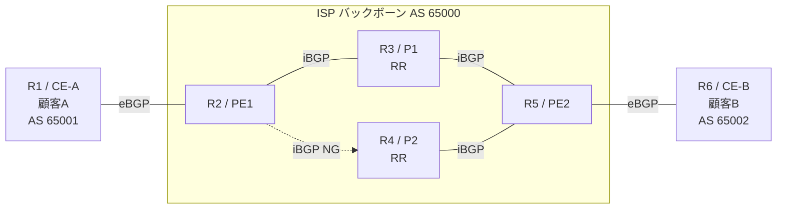

# AI エージェントを使った Router Config 設定

## はじめに

このワークショップでは、AI エージェント（Strands Agents SDK + Amazon Bedrock AgentCore）を使って、ネットワークインフラを自律的に設計、構築を行う作業を体験します。
エージェントは SOP（Standard Operating Procedure: 標準作業手順書）に従い、**ルータ機器からなるネットワーク網への接続・調査・措置の提案・設定変更・ヘルスチェックを自動で実行**します。
参加者は、チャット画面からエージェントに指示を出し、エージェントの動作を確認し、設計から構築まで行います。
これによって、複雑なネットワーク網であってもネットワークの状態を素早く確認し、切り分け、措置を行い、ネットワーク網の新規構築、設定作業を大幅に効率化することが可能になります。  

本ワークショップでは、AWS 上で仮想ルータを模擬していますが、**エージェントから接続可能であればオンプレミスにあるネットワーク網でも実現可能**です。

SOPは、通常、自社のConfig計書書や、作業手順書、ネットワーク仕様書、ベンダー製品仕様書などのドキュメントから作成します。  
本ワークショップでは、ルータ設定作業手順書、ネットワークルータ網設計書、ルータベンダ製品仕様書などのドキュメントから SOP を生成した状態を前提として開始します。  
作成にあたっては、Kiro のような AI エージェントを使って、自社ドキュメント類から作成が可能です。

---

## 環境へのアクセス

### 1. WebUI にログイン

1. ブラウザで以下の URL にアクセスします
   ```
   https://<配布された CloudFront URL>
   ```
2. ログイン画面が表示されます。以下の認証情報を入力してください
   - **Username**: `demo`
   - **Password**: `Demo1234!`
3. 「Sign In」をクリック

### 2. 画面構成

ログイン後、3カラムの画面が表示されます。

```
┌──────────────┬─────────────────────┬──────────────────┐
│ 左パネル      │  中央パネル          │  右パネル（チャット）│
│              │                     │                  │
│ SOP 一覧     │  SOP 内容の         │  AI エージェントと │
│ ドキュメント  │  プレビュー・編集    │  の対話画面       │
│              │                     │                  │
│ クリックで    │  「▶ 実行」ボタンで  │  エージェントの    │
│ 中央に表示   │  チャットに送信      │  応答・ツール実行  │
└──────────────┴─────────────────────┴──────────────────┘
```

- **左パネル**: SOP やドキュメントの一覧。クリックすると中央パネルに内容が表示されます
- **中央パネル**: SOP の内容を確認・編集できます。「▶ 実行」ボタンを押すとチャット入力欄にメッセージが入ります
- **右パネル**: AI エージェントとのチャット画面。ここからエージェントに指示を出します

### 3. シナリオの切り替え

画面上部のタブで「Router Config」「UPF Deployment」「Agent Code」を切り替えられます。
- **Router Config / UPF Deployment**: 各シナリオの SOP を実行
- **Agent Code**: エージェント実装コード（agents/ 配下）を読み取り専用で閲覧可能
切り替えると左パネルの SOP 一覧が変わります。

---


## パート 1: ネットワーク網の新規構築


### シナリオ

6台のルーターで構成された**ISP バックボーンネットワーク**があります。
あなたは、そのネットワークの開発担当であり、設計、構築、検証などを行っています。
ただし、新規に着任したばかりで、ネットワークの技術知識もなく、対象ネットワークの仕様も十分に理解できていません。
今回は、ネットワークの新規構築作業において、通常数時間～数日以上かかる作業を AI エージェント使って効率化し、潜在的な課題を発見し是正まで行います。
また、チャットベースでの指示と SOP の組み合わせにより、ネットワークの技術スキルが不十分であっても、容易に、かつ、一貫性のある作業を実施できます。

※本Workshopでは、模擬的に 6 台のルーターで構成されていますが、実際の通信事業者のネットワークは数千～数百万台規模になり、
AI エージェントの活用の効果がさらに高まります。


**このネットワークは一見正常に動作していますが、隠れた冗長性の問題が仕込まれています。**
冗長性（redundancy）とは「障害時でも通信が止まらないよう、経路を2重化する設計」のこと。
AI エージェントがその欠陥を発見して是正するのが本シナリオの肝です。

> **🎓 ISP バックボーンって何？**
>
> インターネットサービスプロバイダ（ISP）が運用する、
> **大規模な通信ネットワーク**のこと。
> ユーザー（企業や個人宅）から預かったトラフィックを、インターネット全体へ中継する役割を持ちます。



> **🎓 用語解説（専門用語がたくさん出てきますが、難しく考えなくて大丈夫です）**
>
> - **AS**（Autonomous System: 自律システム）= 1つの組織が管理するネットワークの単位。各 ISP や大企業が番号を持つ
> - **CE**（Customer Edge: 顧客拠点側ルーター）= 顧客のオフィス等に置かれるルーター
> - **PE**（Provider Edge: ISP 側の境界ルーター）= ISP のうち、顧客を収容するルーター
> - **P**（Provider Core: ISP のコアルーター）= ISP 内部のみで通信するルーター（顧客には直接接続しない）
> - **eBGP**（external Border Gateway Protocol）= 異なる AS 間（ISP と顧客の間）で経路情報を交換するプロトコル
> - **iBGP**（internal BGP）= 同じ AS 内（ISP 内部）で経路情報を共有するプロトコル
> - **Route Reflector**（経路反射装置）= iBGP セッション数を減らすための中継役（P1, P2 が担当）


### Chat タブについて

**全 Step を同じチャットタブで実行** してください。
最後のレポート生成 SOP でそれまでの実行結果（ネットワークの状態の分析、ヘルスチェック、是正措置の内容など）を統合するため、
会話履歴（コンテキスト）を維持する必要があります。

- タブを切り替えると会話コンテキストがリセットされます
- Session Storage（`/mnt/workspace`）もタブごとに独立するため、clone したリポジトリや設定変更が失われます

タブの操作：
- **新しいタブを開く**: チャットタブ欄の「+」ボタンをクリック（別の演習を試すとき用）
- **タブを切り替える**: タブ名をクリック
- **タブを閉じる**: タブ名にマウスを乗せると表示される「×」をクリック

### 手順

#### Step 1: トポロジ分析

> 🎯 **何をする？**: 6 台のルーターにSSHアクセスし、役割（顧客側 / ISP 境界 / ISP コア）と
> 他のルーターとの接続関係を取得して、ネットワーク網の構成図を作成してもらいます。

> 📌 **チャットタブ**: `Chat 1`（初期タブ）を使用してください

チャット欄に以下の文章を張り付けて、AI エージェントに依頼します：

```
現在の ISP バックボーンのネットワーク構成を調べて、トポロジ図を作って。
```

エージェントは利用可能な SOP を確認し、`topology-analysis` が該当すると判断して自律的に実行します。
6 台のルーターに接続し、属性情報と BGP ネイバー関係を調査して、Mermaid トポロジ図を生成します。

ToolBlock（🔧 マーク）をクリックすると、各コマンドの入出力を確認できます。

**確認ポイント**:
- 全 6台から情報が取得でき、CE/PE/P の役割が識別されること
- 3層構造が Mermaid 図で可視化されること
- iBGP セッションの状態（Established / Idle / Connect (never)）が記録されること

---

#### Step 2: ヘルスチェック — 問題の発見

> 🎯 **何をする？**: ルーター同士の接続（BGP セッション）が全て正常かの確認に加えて、
> **「1 箇所が壊れても通信が続けられる冗長性があるか」**を点検します。
> 通信テストで「疎通 OK」に見えても、冗長性が足りない状態についても、AI が網羅的にチェックして気づくことが可能です。

> 📌 **チャットタブ**: Step 1 と **同じタブ** で続けてください

```
ルーター網の健全性を確認して。通信に問題がないか、冗長性に欠けている箇所がないかを見てほしい。
```

エージェントが全ルーターの正常性を網羅的に確認します。

**🔍 注目ポイント**: 通信は全て正常ですが、エージェントが **冗長性の確認** で警告を検出するはずです。

```
⚠️ PE1 ↔ P2 の iBGP セッションが Idle もしくは Connect (never) 状態
⚠️ PE2 は Customer A のプレフィックスを P1 経由の1本でしか受信していない
⚠️ P1 障害時に Customer A → Customer B の通信が断絶するリスク
```

> 💡 **ここが AI の価値**: 通信は正常に動作しているため、人間は「問題なし」と判断しがち。
> しかし AI が全ての項目をSOPに沿って、網羅的にチェックすることで、障害が起きる前に冗長性の欠如を発見できる。

---

#### Step 3: iBGP セッション障害の是正

> 🎯 **何をする？**: Step 2 で見つかった iBGP セッション Idle もしくは Connect (never) の原因を調査し、
> 設定ミス（今回のケースでは、ネイバー間の認証パスワード不一致等）を特定して修正します。**変更前には必ずユーザー承認（HITL）を求めます。**

> 📌 **チャットタブ**: Step 2 と **同じタブ** で続けてください（冗長性の情報を使うため）

前の Step で検出された問題をエージェントが覚えているため、簡潔に依頼します：

```
さっき見つかった iBGP 接続 の問題を修正して、冗長性を回復させて。
```

エージェントが以下の手順で是正を進めます：

1. **根本原因の特定**: PE1 の BGP ネイバー詳細を確認 → パスワード不一致を発見
2. **設定の比較**: PE1 と P2 の BGP 設定を比較
3. **是正計画提示**: ここでエージェントが一旦停止し、承認を求めます

> **⏸ エージェントが是正計画を提示して停止します。**
> 内容を確認し、問題なければチャットに以下を入力して送信してください：
>
> ```
> OK、進めて。
> ```

承認後、エージェントが続きを実行します：

4. **パスワード修正**: PE1 の設定を変更
5. **BGP セッション確立確認**: Established になることを確認
6. **冗長パス復活確認**: PE2 が Customer A のプレフィックスを2本のパスで受信

---

#### Step 4: ヘルスチェック再実行

> 🎯 **何をする？**: Step 3 の修正が本当に効いたかを確認します。
> 同じヘルスチェックを再実行して、Step 2 で警告だった項目が全て解消されたことを確かめます。

> 📌 **チャットタブ**: Step 3 と **同じタブ** で続けてください

```
もう一度ヘルスチェックをして、問題が解消されたか確認して。
```

**✅ 確認ポイント**: Step 3 で検出された iBGP 接続の問題 と冗長性警告が解消され、全項目が ✅ になること

---

#### Step 5: 作業レポートの生成

> 🎯 **何をする？**: Step 1〜4 で集めた情報（トポロジ、発見した問題、実施した修正、効果）を
> 1 つの Markdown レポートにまとめます。管理部門、上層部などに提出できる形式で出力されます。

> 📌 **チャットタブ**: Step 4 と **同じタブ** で続けてください（全実行結果を統合するため）

```
今日の調査・是正内容をまとめて、レポートを作成して。
```

エージェントがこれまでのトポロジ分析・ヘルスチェック・是正実施結果を統合して Markdown レポートを生成します。

**✅ 確認ポイント**:
- Mermaid トポロジ図が含まれる
- エグゼクティブサマリー（全体判定）が記載される
- 発見事項が重要度別に整理される
- 実施した是正内容とその効果が記載される

---

#### Step 6: SOP の動的な修正を行う

SOP はリアルタイムに自然言語で修正可能です。
例えば、開発、設計、構築、検証作業においては、作業中に手順を更新したい場合、あるいは、改善したい場合があります。
システムプロンプトやナレッジベースのドキュメントを修正して更新せずに、リアルタイムに手順をその場で更新することができます。
また、SOPは、人間が読んで理解できる文章で、かつ、AI エージェントもそのSOP従って動作を行うことが可能です。
本 Step では、ヘルスチェックの手順で、メモリ使用率を確認する工程を追加するシナリオを体験します。

1. 画面上部の **Router Config** タブで左パネルから `health-check` をクリック
2. 中央パネルの右上 **Edit** ボタンをクリック
3. 任意のステップに「メモリ使用率チェック」などのカスタム項目を追加:

   ````markdown
   ### X. メモリ使用率チェック（追加）

   ```bash
   ssh_command router-03 "sudo vtysh -c 'show memory'"
   ```

   **Constraints:**
   - You MUST check: メモリ使用率が 80% 未満であること
   ````

4. **Save** をクリック（S3 の SOP が即座に更新される）
5. **同じタブで** `Router のヘルスチェックを実行して` を送信
6. 追加したステップが実行されることを確認

> 💡 **ここがポイント**: エージェントのコード自体を変更せず、SOP（手順書）を編集するだけで
> 作業手順をリアルタイムにカスタマイズできる。作業者が AI の実装を知らなくても手順を改善可能。

---

---

## 自由に試してみましょう （オプション）

SOP の実行以外にも、チャットでエージェントに自由に質問や指示ができます。

### Router シナリオの例

**診断・確認系:**
```
Router-01 の running config を見せて
```
```
全ルーターの BGP ネイバー状態を表にまとめて
```
```
各ルーターの OSPF 状態を確認して、異常があれば報告して
```

**分析系:**
```
PE1 と PE2 の設定を比較して、差分を説明して
```
```
Customer A のプレフィックスが Customer B に届く経路を説明して
```

**変更系（承認あり）:**
```
Router-03 に新しい static route 10.99.0.0/16 を追加して
```
```
PE2 の OSPF タイマーを hello=5, dead=20 に変更したい。影響を説明してから進めて
```

### シナリオ横断的な質問

```
今日実行した SOP の結果をまとめて、レポートを作成して
```
```
このネットワークで起こりうる典型的な障害パターンを教えて
```
```
あなたが持っている全てのツールとその使い方を教えて
```

---

## トラブルシューティング

### エージェントが応答しない
- チャットの停止ボタン（⏹）を押してから、再度メッセージを送信してください
- 新しいチャットタブを開いて試してください

### ツール実行がエラーになる
- ToolBlock を開いて OUTPUT を確認してください
- SSH 接続エラーの場合、しばらく待ってから再試行してください（Instance Connect の一時鍵は 60 秒で期限切れ）

### SOP が見つからない
- 左パネルのシナリオタブ（Router Config / UPF Deployment）が正しいか確認してください

### ログインできない
- Username: `demo` / Password: `Demo1234!` を確認してください
- ブラウザのキャッシュをクリアして再試行してください
