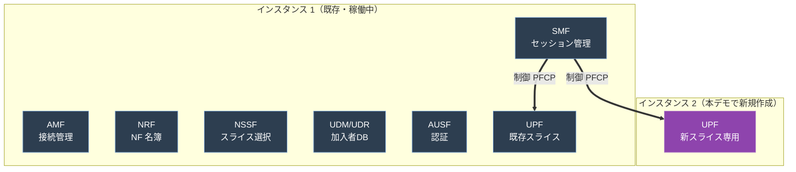

# AI エージェントでコアネットワークのパラメータ設計、デプロイ自動化 - ネットワークスライスの追加

## はじめに

このワークショップでは、AI エージェント（Strands Agents SDK + Amazon Bedrock AgentCore + SOP）を使って、通信事業者のネットワークインフラを自律的に運用するデモを体験します。
エージェントは SOP（Standard Operating Procedure: 標準作業手順書）に従い、NF（Network Function：ネットワークアプリケーション）や GitHub のような外部システムにアクセスし、現在の状態や設定内容の確認・調査・パラメータの設計、設定の変更とデプロイ、状態確認を自動で実行します。参加者はチャット画面からエージェントに指示を出し、エージェントの動作確認し、設計からデプロイまで行います。
これによって、複雑なネットワーク設計であっても、ネットワークの状態や設定内容を素早く確認し、パラメータ設計、インフラからアプリケーションまでデプロイとパラメータ設定作業を大幅に効率化することが可能になります。

本ワークショップでは、コアネットワークのスライス追加（仮想ネットワークの追加）作業を想定していますが、**独自の仕様に沿った複雑なパラメータ設計やアプリケーションの設定、デプロイといった作業**に応用可能です。  
類似ユースケース：基地局のパラメータ設計・設定、ネットワークのパラメータ設計・設定、独自アプリやシステムのパラメータ設計・設定、など  

また、SOPは、通常、自社のパラメータ設計書や、作業手順書、仕様書などのドキュメントから作成します。  
本ワークショップでは、ネットワークの設計書、パラメータ設計書、デプロイ手順書などのドキュメント類からSOPを生成した状態から開始しています。  
SOP の作成には、Kiro のような AI エージェントを使って作成が可能です。

### 進め方のポイント

Step 3（デプロイ）で 新 EC2 とその上のアプリケーションがデプロイされるまで **10〜15 分**かかります。
パート 1 「設定ファイルやネットワークの状態を確認し、パラメータを設計、デプロイ」を実施後、デプロイの完了を待ってからパート 2 「ヘルスチェック・レポート生成」に進んでください。

---

## 環境へのアクセス

### 1. WebUI にログイン

1. ブラウザで以下の URL にアクセスします
   ```
   https://<配布された CloudFront URL>
   ```
2. ログイン画面が表示されます。以下の認証情報を入力してください
   - **Username**: `demo`
   - **Password**: `Demo1234!`
3. 「Sign In」をクリック

### 2. 画面構成

ログイン後、3カラムの画面が表示されます。

```
┌──────────────┬─────────────────────┬──────────────────┐
│ 左パネル      │  中央パネル          │  右パネル（チャット）│
│              │                     │                  │
│ SOP 一覧     │  SOP 内容の         │  AI エージェントと │
│ ドキュメント  │  プレビュー・編集    │  の対話画面       │
│              │                     │                  │
│ クリックで    │  「▶ 実行」ボタンで  │  エージェントの    │
│ 中央に表示   │  チャットに送信      │  応答・ツール実行  │
└──────────────┴─────────────────────┴──────────────────┘
```

- **左パネル**: SOP やドキュメントの一覧。クリックすると中央パネルに内容が表示されます
- **中央パネル**: SOP の内容を確認・編集できます。「▶ 実行」ボタンを押すとチャット入力欄にメッセージが入ります
- **右パネル**: AI エージェントとのチャット画面。ここからエージェントに指示を出します

### 3. シナリオの切り替え

画面上部のタブで「Router Config」「UPF Deployment」「Agent Code」を切り替えられます。
- **Router Config / UPF Deployment**: 各シナリオを選択し、SOP を確認、編集、実行が可能。UPF Deployment では、パラメータ設計書のようなドキュメントも参照可能。
- **Agent Code**: エージェント実装コードを読み取り専用で閲覧可能
切り替えると左パネルの SOP 一覧が変わります。

---

### 本シナリオの背景

このシナリオでは、**GitHub で管理されている 5G コアネットワークの設定ファイル** を扱います。
初期状態として、EC2 インスタンス上で 5GC NFアプリが既に稼働している想定です。
エージェントが現状の設定内容を分析し、必要な変更を加え、GitHub 経由でデプロイをSOP(手順書)に従いながら自律的に行います。

> **🎓 5G コアネットワークって何？（初学者向けの簡単な解説）**
>
> 携帯電話や IoT 機器がインターネットに繋がるためには、基地局（アンテナ）の奥にある「コアネットワーク」という
> 複数のサーバが連携するシステムが必要です。5G ではこれを「5GC」と呼びます。
>
> **NF（Network Function）とは** 5G コアネットワークを構成する**ソフトウェア部品**のことです。
> 4G までは専用ハードウェア装置で実現していた機能を、5G ではコンテナで動くマイクロサービスに分割して実装します。
> AMF・SMF・UPF などはすべて NF の一種で、それぞれが 1 つの役割を担当し、必要に応じて個別にスケールできます。
> 本デモで使う free5GC も、この NF 群を Docker で起動する構成です。
>
> 主な 5GC NF:
> - **AMF**（Access and Mobility Management Function）= 接続管理サーバ。端末がネットに繋がる最初の窓口
> - **SMF**（Session Management Function）= セッション管理サーバ。通信経路を決める司令塔
> - **UPF**（User Plane Function）= パケット処理サーバ。実際のデータを流すルーター的存在
> - **NSSF**（Network Slice Selection Function）= スライス選択サーバ（次の段落で説明）
>
> これらが連携して動作するため、**設定を1箇所変えると他のサーバの設定も整合させる必要があります**。

> **🎓 ネットワークスライスって何？**
>
> スライス（Slice = 「切り分ける」の意味）は、**1つの物理的なネットワーク上に、用途ごとに仮想的な専用ネットワークを作る仕組み**です。
> 例えば、同じ物理ネットワーク上で以下を同居させられます:
> - **高速大容量スライス**（動画・AR/VR 向け）
> - **低遅延スライス**（自動運転・遠隔手術 向け）
> - **大量接続スライス**（IoT センサー 向け）
>
> 各スライスには識別番号（**S-NSSAI** = Single Network Slice Selection Assistance Information）が付与されます。

このシナリオでは、複数の 5GC NFアプリの設定ファイル（amfcfg.yaml, smfcfg.yaml, upfcfg.yaml, nssfcfg.yaml 等）にまたがる
新スライスの追加作業を行います。
**今回は新スライス専用の UPF (パケット処理サーバ) を別の EC2 インスタンスとしてデプロイ**します

### 参考アーキテクチャ



- **制御通信 PFCP（Packet Forwarding Control Protocol）**: SMF（セッション管理サーバ） が UPF（パケット処理サーバ） に「どのユーザーをどう処理するか」を指示
- 新 UPF を別インスタンスに置くことで、既存サービス（インスタンス 1）を止めずに拡張できる


## Step 0: エージェントの短期記憶を確認 - AgentCore Memory を体感する

本格的なシナリオに入る前に、エージェントが会話の文脈を覚えていることを確認します。

> 📌 **チャットタブ**: `Chat 1`（初期タブをそのまま使用）

1. チャットに以下を送信:
   ```
   私の名前は田中です。今日のデモで覚えておいてください。
   ```
2. エージェントが応答したら、**同じタブで**続けて送信:
   ```
   私の名前は何でしたか？
   ```
3. 「田中です」と応答すれば短期記憶（セッション内の会話履歴）が動作

**セッション跨ぎの長期記憶テスト:**
1. **新しいタブ**を開く
2. 同じ質問を送信: `私の名前は何でしたか？`
3. AgentCore Memory の LTM（Long-Term Memory）に抽出されていれば、別タブでも「田中」と覚えている
4. （LTM の抽出は非同期で 5-10 秒かかるため、すぐに試すとまだ覚えていない場合あり）

> 💡 **ここがポイント**: 短期記憶はセッション内の会話全文を参照。
> 長期記憶は重要な事実のみ抽出してセッション跨ぎで保持。
>
> これ以降の Step では、エージェントは各タブ内で文脈を保持しながら SOP を実行します。

---

## パート 1: 設定ファイルやネットワークの状態を確認し、パラメータを設計、デプロイ

> ⏱ **このパートの最後（Step 3）では、Gitを介して 新しいEC2 とそのうえにアプリケーションがデプロイされます（10〜15 分）。**
> その待ち時間にもう一方のシナリオ（Router Config 設定シナリオ）を進めることをおすすめします。別のChatタブであれば、同時に2つのシナリオを進めても問題ありません。


### 手順

> ⚠️ ** 本シナリオも全 Step を同じチャットタブで実行してください。**
> 最後のレポート生成で全 Step の結果を統合するため、コンテキストを維持する必要があります。
> また、タブを切り替えると `/mnt/workspace`（作業領域）がリセットされ、
> clone したリポジトリや設定変更が失われます。

#### Step 1: 現状のソースコード (パラメータ設定) の確認

> 🎯 **何をする？**: GitHub 上にある 5GC ネットワークアプリケーションの設定ファイル（YAML）を読み込み、
> 今どんなスライスが構成されているか、NF アプリ（サーバ） 間で設定に矛盾がないか、整合性をエージェントが解析します。

> 📌 **チャットタブ**: `Chat 1`（初期タブをそのまま使用）

1. シナリオを「UPF Deployment」に切り替えてください（画面上部のタブ）
2. 現状を把握するため、業務指示として送信します（**自分のグループの GitHub リポジトリ URL を含めてください**）：

```
GitHub リポジトリ: https://github.com/<your-org>/free5gc-compose-group-XX

上記リポジトリの 5GC のコード構成を分析して。どんなスライスが設定されているか教えて。
```

> 💡 **リポジトリ URL を毎回伝える**: グループごとにリポジトリが異なるため、
> 各 Step の依頼プロンプトにリポジトリ URL を含めてください。
> 一度伝えれば、エージェントは同じチャット内で記憶します（以降の Step では省略可）。

エージェントは利用可能な SOP を確認し、`code-analysis` （ソースコード分析 SOP） が該当すると判断して自律的に読み込み・実行します。

**確認ポイント**:
- リポジトリ情報（ブランチ、最新コミット）が表示されること
- 現在のスライス構成が表示されること
- サーバ間の整合性チェック結果が表示されること（✅ / ❌ / ⚠️）

---

#### Step 2: 新スライスの設計

> 🎯 **何をする？**: 設定ファイルの現状 + **実機（インフラからコンテナ）の稼働状態** + リファレンスドキュメントを見比べて、
> 既存スライスと重複しない新スライスのパラメータ（S-NSSAI, DNN, IP Pool）と UPF 配置を設計します。
> このステップでは **ファイルは変更しません**（設計案の提示のみ）。

> 📌 **チャットタブ**: Step 1 と **同じタブ** で続けてください

業務依頼の形で送信します：

```
新しいネットワークスライスを追加したい。
UPF は、既存サービスへの影響を避けるため、新しい EC2 インスタンスにデプロイしてほしい。
まず設計案を作成して。
```

エージェントはリポジトリの状態と実機の稼働状況を確認した上で、
リファレンスドキュメント（スライスタイプ一覧、IP アドレス割り当てガイドライン等）を参照しながら設計案を提示します。
※各パラメータの用語の意味について深い理解は必要なく、**パラメータ設計がAIエージェントによって迅速に行われている**点をご確認ください。

設計案には以下が含まれます:
- **S-NSSAI**（スライス識別番号）= `SST`（Slice/Service Type: スライス種別）+ `SD`（Slice Differentiator: スライス識別子）
- **DNN**（Data Network Name: データネットワーク名、接続先の識別子）
- **IP Pool**（端末に割り当てる IP アドレス範囲、既存スライスと重複しないように選定）
- **UPF 配置先**（今回は新しい EC2 インスタンス）

🔍 **注目ポイント**: エージェントがリファレンスを参照し、既存設定と重複しないパラメータを自律的に選ぶ過程を観察してください。

> 📝 **このステップは設計のみ。** ファイル変更やデプロイは次のステップで行います。

---

#### Step 3: デプロイ

> 🎯 **何をする？**: Step 2 の設計に基づいて設定ファイルを変更し、GitHub に push します。
> 新しい EC2 インスタンス を CloudFormation （IaC）で構築し、新しい UPF をデプロイ。
> 既存サービスに影響が出ていないかも確認します。**変更前には必ずユーザー承認（HITL）を求めます。**

> 📌 **チャットタブ**: Step 2 と **同じタブ** で続けてください（設計のコンテキストを引き継ぐため）

デプロイを依頼します：

```
この設計でデプロイを進めて。既存サービスに影響を与えないように注意して。
```

エージェントは変更計画を作成し、diff 形式で承認を求めて一旦停止します。

> **⏸ エージェントが変更案を提示して停止します（ユーザーの承認を求めます）。**
> 実際には、内容を確認しますが、本シナリオでは問題ないことを確認した、という前提で、 **同じタブで** 以下を入力して送信してください：
>
> ```
> OK、進めて。
> ```

承認後、エージェントが続きを実行します：

1. **設定ファイル変更**: 
   - 各 5GC 設定 yaml ファイル（amfcfg, smfcfg, nssfcfg, 新 UPF 用 upfcfg）
   - **CloudFormation IaC テンプレート（`infra/cloudformation.yaml`）** に新 UPF 用 EC2 リソースなどを追加   
2. 既存サービスの状態確認
3. **GitHub に push**: 変更をコミットして GitHub に push
4. **CI/CD の実行（GitHub Actions）**: CloudFormation IaC によって、新しい EC2～ UPF (パケット処理サーバ) アプリケーションまでデプロイ
5. **既存サービスへの影響確認**: 既存コンテナの起動時刻が変わっていないか確認
6. **デプロイ結果の確認**: 新 UPF が 新しい EC2 で起動していることを確認

   🔍 **注目ポイント**: エージェントが 設定ファイルの変更に加えて、インフラ～アプリまでのデプロイを行っている点を観察してください

> 💡 **代替パス**: 設計を飛ばして、パラメータを直接指定してデプロイすることも可能です。例:
> ```
> SST=2, SD=000001, DNN=new-dnn, IP Pool=10.70.0.0/16 のスライスを新 EC2 の UPF でデプロイして
> ```

---

> ⏱ **Step 3 で push 後、CI/CD（GitHub Actions）によるデプロイ実行中（5〜15 分）は待ち時間になります。**
> 時間がある場合は、別のチャットタブで **Router Config 設定シナリオ**を並行して進めることができます。

---

## パート 2: ヘルスチェック・レポート生成（デプロイ 完了後）

> ⏱ **GitHub Actions が完了していることを確認してから進めてください。**
> GitHub の Actions タブで最新の run が ✅ になっていれば OK です。
> AI エージェントに、GitHub Actions （デプロイ）が完了しているか聞くことでも確認可能です。

#### Step 4: GitHub で変更を確認

> 🎯 **何をする？**: エージェントが GitHub に push したコミットの diff を
> 人間の目で確認します。「既存を変えず追加のみ」になっていること、
> GitHub Actions の実行ログを見て新 EC2 作成〜デプロイの流れを追います。

1. ブラウザで `https://github.com/<your-org>/<your-repo>` を開く
2. **Commits** タブで最新のコミット（エージェントが作成したコミット）を開く
3. `config/` 配下の YAML ファイルの差分を確認（既存エントリは変更なし、新エントリのみ追加されているはず）
4. **Actions** タブで実行中/完了の GitHub Actions を開く

> 💡 **注目ポイント**: AI が「既存を変更せず追加のみ」で設定を修正していることを差分で確認できます。

---

#### Step 5: デプロイ反映と簡易確認

> 🎯 **何をする？**: GitHub Actions で起動した新 UPF EC2 の IP を取得し、
> 既存 EC2 に設定変更を反映、デプロイ結果を簡易確認します。

> 📌 **チャットタブ**: Step 1〜4 と **同じタブ** で実行してください

```
Actions が完了しました。続きを進めてください。
```

エージェントが slice-deploy SOP の続き（Step 7 以降）として以下を実行します：
- CloudFormation IaC によるデプロイの実行結果 から新 EC2 の Private IP を取得
- 既存 EC2 への設定反映
- 新 UPF コンテナの Up 確認

**✅ 確認ポイント**:
- 新 UPF が新しい EC2 で Running 状態
- SMF（セッション管理サーバ） ログに新 UPF との PFCP Association Setup Accepted

---

#### Step 6: ヘルスチェック（全体バリデーション）

> 🎯 **何をする？**: 5GC 全体が正常稼働しているか、既存サービスに影響が出ていないか、
> 新スライスが全 NF に正しく設定されているかを独立した SOP で詳細に検証します。

> 📌 **チャットタブ**: Step 5 と **同じタブ** で OK（コンテキストを引き継いで検証可能）

```
5GC の正常性を確認して。既存サービスに影響が出ていないか、新 UPF が別 EC2 で正しく動いているかを見てほしい。
```

エージェントが health-check SOP （ヘルスチェック SOP ）を実行して以下を検証します：
- 全サーバが正常稼働しているか
- SMF（セッション管理サーバ） と既存 UPF の PFCP 接続が維持されているか（既存 UPF （ユーザーのパケット処理）に影響無し）
- 新 UPF（別 EC2）との PFCP 接続が確立しているか
- 新スライスが全サーバで正しく設定されているか

**✅ 確認ポイント**:
- 既存コンテナが再起動されていないこと（StartedAt が古い時刻のまま）
- PFCP Association が全 UPF と確立
- バリデーションレポートが PASS

---

#### Step 7: レポート生成

```
今日の作業内容をまとめて、変更管理チーム向けのレポートを作成して。
```

エージェントが Step 1〜6 の全結果を統合した完了レポートを生成します。

**✅ 確認ポイント**:
- 変更前の状態、設計内容、実施内容、ヘルスチェック結果が記載される
- 既存サービスへの影響なしが明記される
- ロールバック手順が含まれる

---

#### Step 8: Agent Code（実装コード）を見る （オプション）

画面上部の **Agent Code** タブから、このエージェントの実装コードを閲覧できます。

1. 上部タブ **Agent Code** をクリック
2. 左パネルからファイルを選択:
   - `agent.py` — システムプロンプト、モデル設定
   - `app.py` — AgentCore Runtime エントリポイント、MemoryHook 実装
   - `tools/common.py` — run_command, read_sop 等のツール実装
   - `tools/k8s.py` — ssh_command（EC2 Instance Connect 経由の SSH）

> 💡 **ここがポイント**: エージェントがどのように動いているかをコードレベルで理解できる。
> システムプロンプトの「絶対禁止事項」「SOP 実行ルール」等を見ると、
> プロンプトエンジニアリングの一端を学べる。

---

---

## 自由に試してみましょう （オプション）

SOP の実行以外にも、チャットでエージェントに自由に質問や指示ができます。

### 例

**診断・確認系:**
```
現在の全コンテナの状態を確認して
```
```
SMF のログで PFCP 関連のメッセージを見せて
```
```
MongoDB（加入者DB） に登録されている加入者の一覧を表示して
```

**分析系:**
```
現在の設定で、どのスライスがどの UPF にルーティングされているか表にして
```
```
AMF と NSSF のスライス定義に矛盾がないか確認して
```

**変更系:**
```
internet DNN の IP pool を 10.60.0.0/16 から 10.70.0.0/16 に変更して
```

### シナリオ横断的な質問

```
今日実行した SOP の結果をまとめて、レポートを作成して
```
```
このネットワークで起こりうる典型的な障害パターンを教えて
```
```
あなたが持っている全てのツールとその使い方を教えて
```

---

## トラブルシューティング

### エージェントが応答しない
- チャットの停止ボタン（⏹）を押してから、再度メッセージを送信してください
- 新しいチャットタブを開いて試してください

### ツール実行がエラーになる
- ToolBlock を開いて OUTPUT を確認してください
- SSH 接続エラーの場合、しばらく待ってから再試行してください（Instance Connect の一時鍵は 60 秒で期限切れ）

### SOP が見つからない
- 左パネルのシナリオタブ（Router Config / UPF Deployment）が正しいか確認してください

### ログインできない
- Username: `demo` / Password: `Demo1234!` を確認してください
- ブラウザのキャッシュをクリアして再試行してください
